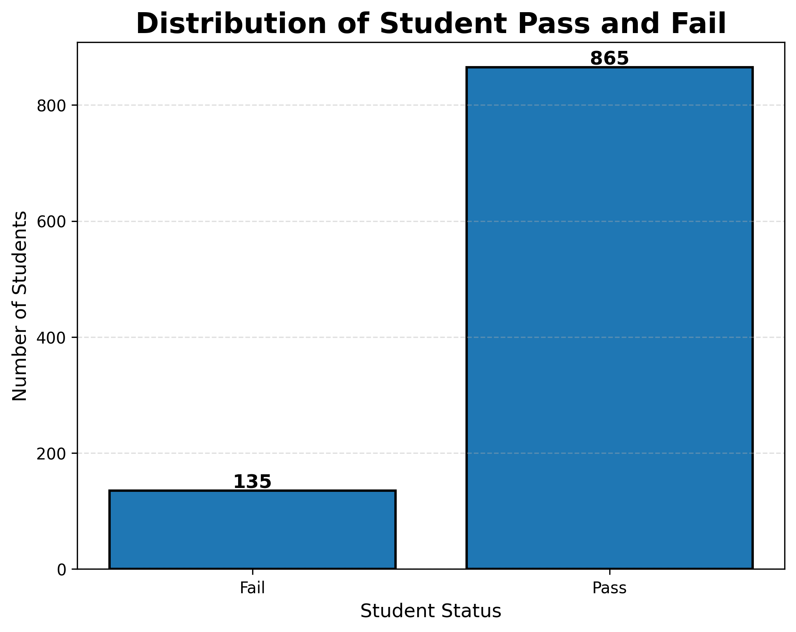
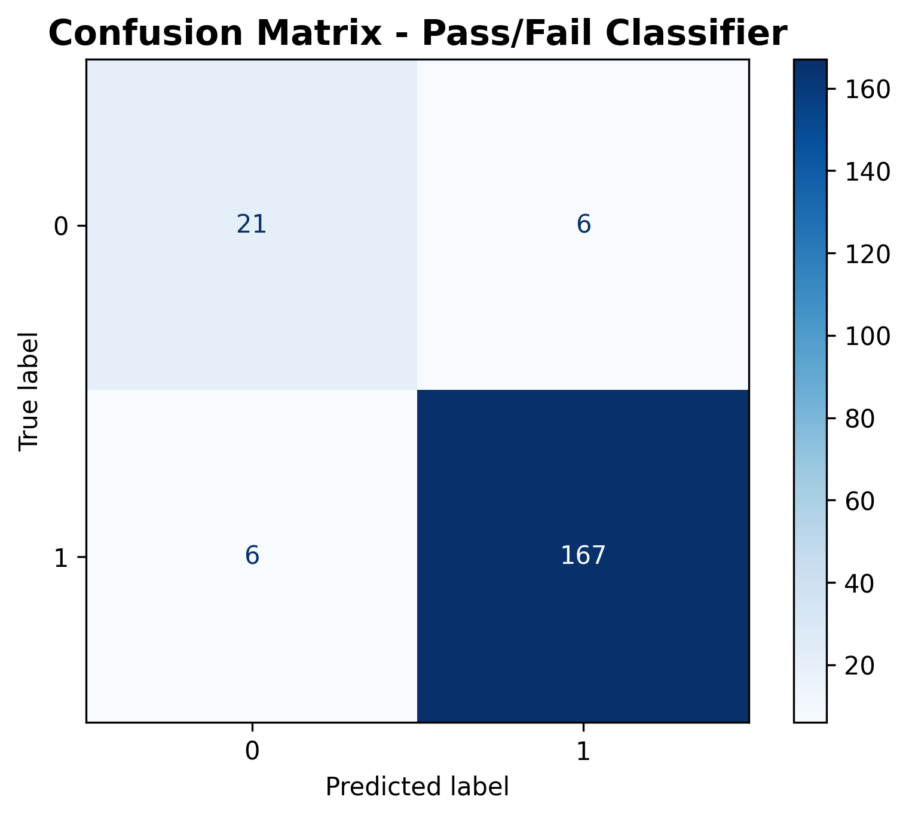

# 🎓 Pass/Fail Student Classifier | Machine Learning Project

---

## 📌 Overview

This project is a **classification machine learning model** that predicts whether a student will **Pass or Fail** based on academic performance data.

It is part of my **Machine Learning Portfolio Journey**, where I build real-world projects step by step.

---

## 🎯 Objective

To classify students into:

- ✅ Pass (1)
- ❌ Fail (0)

based on their academic features.

---

## 📊 Dataset

- Source: Students Performance Dataset (Kaggle/UCI)
- Records: 1000 students

### Features:
- Gender
- Race/Ethnicity
- Parental Education
- Lunch
- Test Preparation Course
- Reading Score
- Writing Score

---

## 🧠 Machine Learning Model

- Algorithm: Logistic Regression
- Type: Classification

---

## ⚙️ Workflow

1. Data Loading
2. Exploratory Data Analysis (EDA)
3. Feature Engineering
4. One-Hot Encoding
5. Train/Test Split
6. Model Training
7. Evaluation

---

## 📈 Model Performance

- Accuracy: **94%**

### Classification Report Summary:

- Precision (Fail): 0.78  
- Recall (Fail): 0.78  
- Precision (Pass): 0.97  
- Recall (Pass): 0.97  

---

## 📊 Visualizations

### 📌 Pass vs Fail Distribution

### 📌 Confusion Matrix

---

## 🔍 Key Insights

- Dataset is slightly imbalanced (more Pass than Fail)
- Model performs better on majority class
- Precision & Recall are more important than accuracy alone
- Logistic Regression is effective for baseline classification

---

## 🛠️ Tech Stack

- Python
- Pandas
- NumPy
- Matplotlib
- Scikit-learn

---

## 📌 Future Improvements

- Handle class imbalance (SMOTE / class_weight)
- Try Random Forest or XGBoost
- Deploy using Streamlit
- Add interactive prediction UI

---

## 👩‍💻 Author

**Rehana Hassan**  
Software Engineering Student | Machine Learning Portfolio Builder 🚀

---

## ⭐ Support

If you like this project:
- ⭐ Star the repository
- 📌 Follow my ML journey